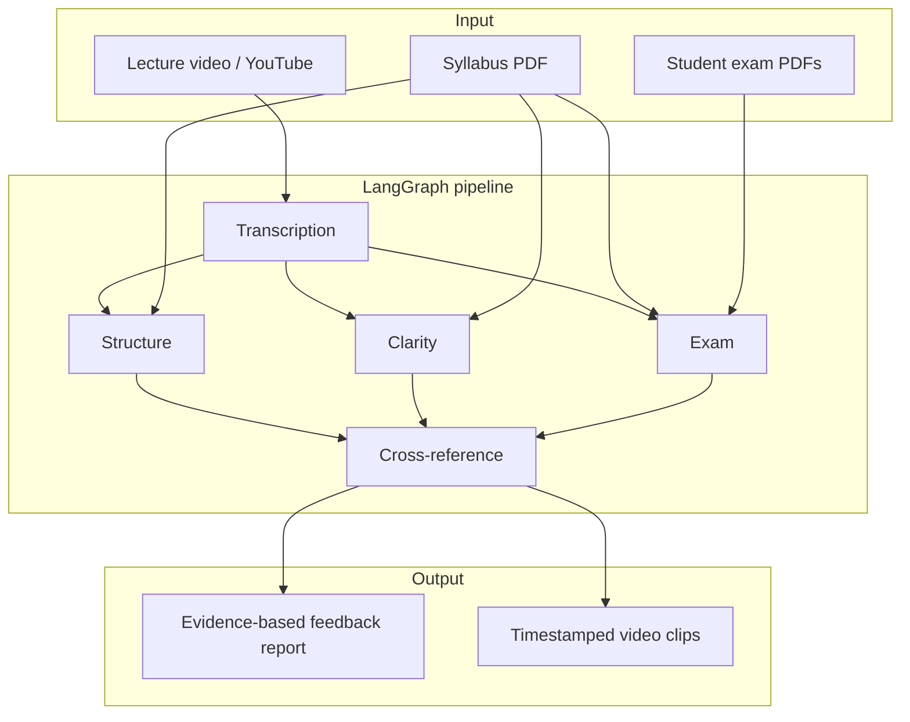

# Veluate

AI-powered teacher evaluation system. Analyses lecture recordings with a multi-agent LangGraph pipeline and cross-references teaching gaps with student exam performance.

## Architecture



## Quick start

### 1. Backend

```bash
cd backend
uv sync
cp .env.example .env        # add API keys (see below)
uv run uvicorn app.main:app --reload
```

Health check: http://localhost:8000/health

### 2. Frontend

```bash
cd frontend
npm install
cp .env.local.example .env.local   # optional
npm run dev
```

Open http://localhost:3000

### 3. Demo on the website

Use two terminals only (backend + frontend). Then demo entirely in the browser:

```bash
# Terminal 1 — backend
cd backend && uv run uvicorn app.main:app --reload

# Terminal 2 — frontend
cd frontend && npm run dev
```

At http://localhost:3000:

1. **Upload** — fill in teacher name, audience, syllabus PDF, a YouTube URL (or video file), and exam PDFs from `sample_data/`
2. **Run evaluation** — you’re redirected to `/jobs/{id}` with live progress
3. **Report** — when done, walk through tabs: Cross-reference → Heatmap → Structure → Exam gaps → Factual accuracy → Evidence clips

**Suggested demo files** (from `sample_data/`):

| Field | File |
|-------|------|
| Syllabus | `sample_data/syllabus/syllabus.pdf` |
| Exams | `sample_data/exams/Student_*.pdf` (select several or all 15) |
| YouTube URL | A short psychology lecture (required if you have no local video) |

See `sample_data/README.md` for details.

### Optional: CLI demo script

For headless testing without the UI (not needed for a website demo):

```bash
cd backend
export DEMO_YOUTUBE_URL="https://www.youtube.com/watch?v=..."
uv run python -m app.scripts.run_demo
```

## Environment variables

### Backend (`backend/.env`)

| Variable | Required | Description |
|----------|----------|-------------|
| `LLM_PROVIDER` | No | `anthropic`, `kimi`, or `openai` (default: `anthropic`) |
| `LLM_MODEL` | No | Override model name for the chosen provider |
| `ANTHROPIC_API_KEY` | If using Anthropic | Claude API key |
| `MOONSHOT_API_KEY` | If using Kimi | Moonshot API key |
| `MOONSHOT_BASE_URL` | No | Kimi API base (default: `https://api.moonshot.ai/v1`; use `.cn` for China keys) |
| `OPENAI_API_KEY` | If using OpenAI | OpenAI API key |
| `BRIGHTDATA_API_TOKEN` | No | Bright Data API key (enables fact-check agent) |
| `BRIGHTDATA_SERP_ZONE` | If using Bright Data | SERP API zone name (e.g. `serp_api1`) |
| `FACT_CHECK_MAX_CLAIMS` | No | Max claims to verify per job (default: `6`) |
| `VIDEODB_API_KEY` | Yes | VideoDB for transcription + clip retrieval |
| `VIDEODB_LANGUAGE_CODE` | No | Transcript language (default: `en`) |
| `DATABASE_URL` | No | SQLite default: `sqlite+aiosqlite:///./veluate.db` |
| `CORS_ORIGINS` | No | Comma-separated (default: `http://localhost:3000`) |
| `DEMO_YOUTUBE_URL` | No | CLI demo script only (`run_demo`) |

### Frontend (`frontend/.env.local`)

| Variable | Description |
|----------|-------------|
| `NEXT_PUBLIC_API_URL` | Backend URL (default: `http://localhost:8000`) |

## Bright Data fact-check (optional)

The **fact_check** agent runs in parallel with structure/clarity/exam. It extracts checkable claims from the lecture transcript and verifies them against web sources via the [Bright Data SERP API](https://docs.brightdata.com/scraping-automation/serp-api/introduction).

1. Sign in at [brightdata.com](https://brightdata.com/cp/start) and create a **SERP API** zone
2. Copy your API key and zone name into `backend/.env`:
   ```env
   BRIGHTDATA_API_TOKEN=your_api_key
   BRIGHTDATA_SERP_ZONE=your_zone_name
   ```
3. Restart the backend and run a job — progress shows **Fact check** as an independent step; results appear under **Factual accuracy** in the report

Without these vars, the pipeline still completes; fact-check is skipped with a note in the report.

Smoke-test your credentials:

```bash
curl -X POST https://api.brightdata.com/request \
  -H "Authorization: Bearer YOUR_TOKEN" \
  -H "Content-Type: application/json" \
  -d '{
    "zone": "YOUR_ZONE",
    "url": "https://www.google.com/search?q=operant+conditioning+definition&hl=en&gl=us",
    "format": "raw",
    "data_format": "parsed_light"
  }'
```

## Switching LLM providers

Set in `backend/.env` — no code changes:

| Provider | `LLM_PROVIDER` | API key | Default model |
|----------|----------------|---------|---------------|
| Anthropic | `anthropic` | `ANTHROPIC_API_KEY` | `claude-sonnet-4-20250514` |
| Kimi | `kimi` | `MOONSHOT_API_KEY` | `moonshot-v1-32k` |
| OpenAI | `openai` | `OPENAI_API_KEY` | `gpt-4o-mini` |

## API (alternative to UI)

```bash
curl -X POST http://localhost:8000/jobs \
  -F "teacher_name=Dr Smith" \
  -F "audience=Psychology undergrads" \
  -F "syllabus=@sample_data/syllabus/syllabus.pdf" \
  -F "youtube_urls=https://www.youtube.com/watch?v=..." \
  -F "exams=@sample_data/exams/Student_1_Beatrice_Lim.pdf"

# Poll results
curl http://localhost:8000/jobs/{job_id}
```

## Project structure

```
backend/app/
  main.py              FastAPI entry
  api/routes/          Job + health endpoints
  graph/               LangGraph pipeline
  agents/              Agent prompts + logic
  services/            LLM, VideoDB, Bright Data, pipeline, demo
  scripts/run_demo.py  CLI demo runner
  db/                  SQLite models
frontend/src/          Next.js dashboard
sample_data/           Demo syllabus, exams, video
```

## Hackathon demo checklist (website)

1. Start backend + frontend (two terminals)
2. Open http://localhost:3000
3. Upload syllabus, YouTube URL, and exam PDFs from `sample_data/`
4. Show live progress on the job page
5. Walk through report tabs: heatmap → exam gaps → cross-reference with clip evidence

## Optional deploy

- **Frontend:** Vercel — set `NEXT_PUBLIC_API_URL` to your backend URL
- **Backend:** Railway — set env vars from `.env.example`, expose port 8000, update `CORS_ORIGINS`