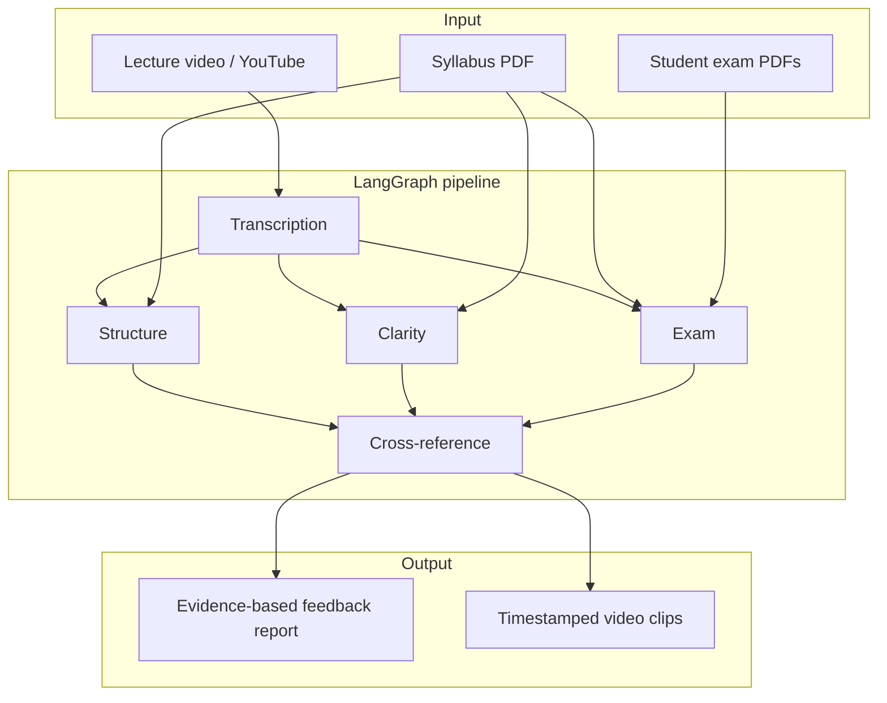

# Veluate

AI-powered teacher evaluation system. Analyses lecture recordings with a multi-agent LangGraph pipeline and cross-references teaching gaps with student exam performance.

## Architecture



## Quick start

### 1. Backend

```bash
cd backend
uv sync
cp .env.example .env        # add API keys (see below)
uv run uvicorn app.main:app --reload
```

Health check: http://localhost:8000/health

### 2. Frontend

```bash
cd frontend
npm install
cp .env.local.example .env.local   # optional
npm run dev
```

Open http://localhost:3000

### 3. Run via UI

1. **Upload** — teacher name, audience, syllabus PDF, video file(s) and/or YouTube URL(s), optional exam PDFs
2. **Job page** (`/jobs/{id}`) — live pipeline progress (polls every 2s)
3. **Report** — tabs for Cross-reference, Heatmap, Structure, Exam gaps, Evidence clips

## Demo script (5-minute hackathon demo)

Run all three terminals (after `uv sync`, `npm install`, and copying `.env`):

```bash
# Terminal 1 — backend
cd backend && uv run uvicorn app.main:app --reload

# Terminal 2 — frontend
cd frontend && npm run dev

# Terminal 3 — demo job (uses sample_data/ + YouTube lecture)
cd backend
export DEMO_YOUTUBE_URL="https://www.youtube.com/watch?v=YOUR_ID"
uv run python -m app.scripts.run_demo
```

Open the dashboard URL printed by Terminal 3 (or http://localhost:3000).

First-time setup for Terminal 3:

```bash
cd backend
cp .env.example .env   # set ANTHROPIC_API_KEY, VIDEODB_API_KEY, etc.
```

The script will:

- Use `sample_data/syllabus/syllabus.pdf` and all 15 exam papers in `sample_data/exams/`
- Create a job, run the pipeline, print the dashboard URL

Options:

```bash
uv run python -m app.scripts.run_demo \
  --youtube-url "https://www.youtube.com/watch?v=..." \
  --max-exams 5 \
  --teacher-name "Dr Lee" \
  --frontend-url "http://localhost:3000"
```

### Sample data

| Path | Status |
|------|--------|
| `sample_data/exams/` | 15 student exam PDFs (Foundations of Psychology) |
| `sample_data/syllabus/syllabus.pdf` | Course syllabus with weekly topics |
| `sample_data/video/` | Add `lecture.mp4` or use `--youtube-url` |

See `sample_data/README.md` for details.

## Environment variables

### Backend (`backend/.env`)

| Variable | Required | Description |
|----------|----------|-------------|
| `LLM_PROVIDER` | No | `anthropic`, `kimi`, or `openai` (default: `anthropic`) |
| `LLM_MODEL` | No | Override model name for the chosen provider |
| `ANTHROPIC_API_KEY` | If using Anthropic | Claude API key |
| `MOONSHOT_API_KEY` | If using Kimi | Moonshot API key |
| `OPENAI_API_KEY` | If using OpenAI | OpenAI API key |
| `VIDEODB_API_KEY` | Yes | VideoDB for transcription + clip retrieval |
| `VIDEODB_LANGUAGE_CODE` | No | Transcript language (default: `en`) |
| `DATABASE_URL` | No | SQLite default: `sqlite+aiosqlite:///./veluate.db` |
| `CORS_ORIGINS` | No | Comma-separated (default: `http://localhost:3000`) |
| `DEMO_YOUTUBE_URL` | For demo script | Default lecture URL for `run_demo` |

### Frontend (`frontend/.env.local`)

| Variable | Description |
|----------|-------------|
| `NEXT_PUBLIC_API_URL` | Backend URL (default: `http://localhost:8000`) |

## Switching LLM providers

Set in `backend/.env` — no code changes:

| Provider | `LLM_PROVIDER` | API key | Default model |
|----------|----------------|---------|---------------|
| Anthropic | `anthropic` | `ANTHROPIC_API_KEY` | `claude-sonnet-4-20250514` |
| Kimi | `kimi` | `MOONSHOT_API_KEY` | `moonshot-v1-32k` |
| OpenAI | `openai` | `OPENAI_API_KEY` | `gpt-4o-mini` |

## API (alternative to UI)

```bash
curl -X POST http://localhost:8000/jobs \
  -F "teacher_name=Dr Smith" \
  -F "audience=Psychology undergrads" \
  -F "syllabus=@sample_data/syllabus/syllabus.pdf" \
  -F "youtube_urls=https://www.youtube.com/watch?v=..." \
  -F "exams=@sample_data/exams/Student_1_Beatrice_Lim.pdf"

# Poll results
curl http://localhost:8000/jobs/{job_id}
```

## Project structure

```
backend/app/
  main.py              FastAPI entry
  api/routes/          Job + health endpoints
  graph/               LangGraph pipeline
  agents/              Agent prompts + logic
  services/            LLM, VideoDB, pipeline, demo
  scripts/run_demo.py  CLI demo runner
  db/                  SQLite models
frontend/src/          Next.js dashboard
sample_data/           Demo syllabus, exams, video
```

## Hackathon demo checklist

1. Run the three terminals above (backend, frontend, demo script)
2. Set `DEMO_YOUTUBE_URL` to a short psychology lecture on YouTube
3. Open the printed `/jobs/{id}` URL
4. Walk through: progress → heatmap peaks → exam gaps → cross-reference with clip evidence

## Optional deploy

- **Frontend:** Vercel — set `NEXT_PUBLIC_API_URL` to your backend URL
- **Backend:** Railway — set env vars from `.env.example`, expose port 8000, update `CORS_ORIGINS`

## Build phases

- [x] Phase 0 — Skeleton
- [x] Phase 1 — Job API + SQLite
- [x] Phase 2 — LangGraph shell
- [x] Phase 3 — Transcription agent + VideoDB
- [x] Phase 4 — Structure + Clarity agents
- [x] Phase 5 — Exam agent
- [x] Phase 6 — Cross-reference agent
- [x] Phase 7 — Frontend dashboard
- [x] Phase 8 — Polish + demo
